# MatrixOps Agent

[English](./README.md) | **简体中文**

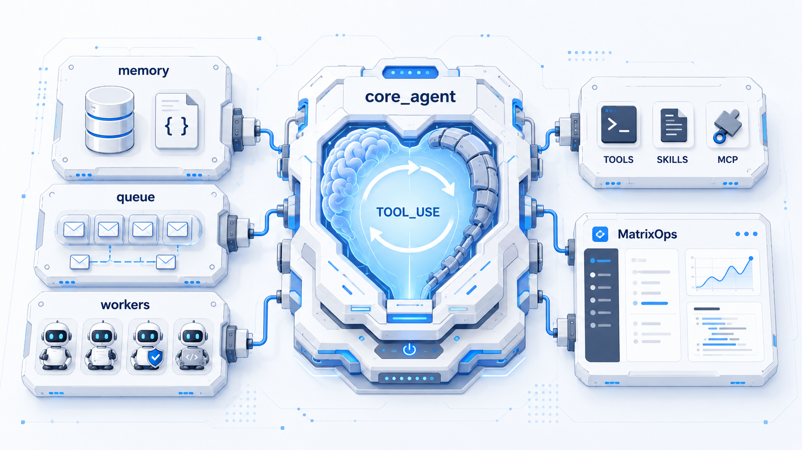

> **MatrixOps Agent** 是通用 AI Agent 框架：**`core_agent`** 为引擎，记忆、队列、Worker 与工具以模块接入；本仓库桌面应用为参考实现。

MatrixOps Agent 是一个**高自由度、通用型 AI Agent 框架**。记忆层已独立抽离，可按场景选择 SQLite 或 JSON 存储，并支持自定义压缩与召回策略；`core_agent` 只承担「大脑 + 心脏」——解析模型输出、驱动工具循环；其余能力以接口接入，为不同场景拼装「躯干」即可落地。

MatrixOps 桌面端是当前框架的一套完整参考实现（多 Worker 编排、Coding Agent、长期记忆、语义回归等），展示如何把通用引擎接到具体产品形态上。

## 产品定位

### 框架优先，场景可插拔

MatrixOps 的目标不是做一个绑死某种 UI 或业务的单体助手，而是提供**可组装的 Agent 运行时**：

| 层次 | 角色 | 职责 |
|------|------|------|
| **`core_agent`（大脑 / 心脏）** | AI 核心发动机 | 流式调用 LLM、解析 action / 工具调用、循环执行工具、通过 emitter 输出状态；**不**绑定具体数据库、前端协议或业务语义 |
| **记忆模块（`agent/memory`）** | 可替换的「长期记忆」 | 独立 Store 接口：SQLite（`DBStore`）、JSON 文件（`JSONFileStore`）等；压缩、召回策略由外层注入，不写死在引擎里 |
| **Session / 队列 / 看门狗等（躯干）** | 场景适配层 | 任务队列、关键信息注入、多模型协作、权限、UI 协议——通过 hook / adapter 接入 `core_agent` |
| **MatrixOps 应用** | 参考实现 | 工作区、Worker、桌面 UI、语义回归测试工作区——证明框架能支撑真实产品开发 |

开发时遵循 **Agent 是一等公民**：一次运行、一条消息流、一套工具循环是核心抽象；**消息队列**不是普通聊天 FIFO，而是向模型**注入关键信息**、协调**多 Agent / 多模型**协作的管道（看门狗警告、异步工具结果、Critical Info 补发等）。

你需要新场景时，通常只需实现「躯干」（存储、工具集、Prompt 层、对外 API），再接到同一套 `core_agent` 引擎上，而不必 fork 或重写 Agent 循环。

### 记忆：已抽离、可定制

`agent/memory` 与 `core_agent` 解耦，调用方通过 `Store` 接口持久化：

- **SQLite** — `DBStore`，适合桌面 / 服务端一体化部署
- **JSON 文件** — `JSONFileStore`，适合调试、迁移或轻量单机场景

记忆**压缩**（如分级 compaction）与**召回**（语义检索、关键信息重注入）在 session 层以策略形式接入，可按产品需求替换，而不修改引擎核心。

### MatrixOps 作为参考应用

在本仓库中，MatrixOps 将上述框架用于「本地优先的 AI 开发工作台」：多 Worker（explore、plan、verification、frontend engineer 等）编排、Git worktree、Diff 审查、仿真视图、iLink 微信接入等，都是**接入大脑后的具体躯干**，而非框架本身的硬编码约束。

## 技术亮点

### 看门狗机制

MatrixOps 不把所有纠错都交给模型自觉完成。内置看门狗持续观察 Agent 循环，在异常迹象出现时向任务队列注入**补充系统消息**：

| 看门狗 | 监测对象 | 行为 |
|--------|----------|------|
| **Stall（卡顿）** | 工具调用超过配置超时 | 取消该调用并排队警告，引导模型换策略 |
| **Silent tool（静默工具）** | 连续多次工具调用但无助手文本输出 | 提示模型说明进展或直接回应用户 |
| **Tool repeat（重复工具）** | 相同工具 + 参数被反复调用 | 警告可能陷入循环，建议换做法 |

这些消息通过下方的补充消息管道送达，无需中断整个会话。

### 消息与队列机制

对话不只有「用户发一句、模型回一句」。MatrixOps 使用**任务消息队列**，支持多种投递方式：

- **用户 / append 消息** — 任务运行中的正常输入与追加指令。
- **Supplement 补充消息** — 系统侧注入（看门狗警告、异步工具结果、空流重试等），在 Agent 循环的安全时机写入会话记忆。
- **Auto-run 自动续跑** — 任务结束后，队列中的下一条消息可自动触发新一轮执行。

这样长时间运行的 Agent 能响应后台事件（工具完成、看门狗、子任务结果），而不必人工复制粘贴。

### 关键信息机制

长会话会经过记忆压缩以控制上下文长度。**关键信息（Critical Info）** 是会话级「必须保留」的事实列表——例如异步工具句柄（`bash_job_id`、子任务 `task_id`）、用户可见占位说明、工具调用指纹等。

每轮 Agent 执行前，运行时会检查关键信息是否仍出现在记忆 transcript 中。若压缩后丢失，则**以合成 user 消息重新注入**，避免模型忘掉进行中的后台任务。

### 语义回归测试

项目通过三层**语义回归**体系守护质量（`pkgs/semreg`、`tests/semantic_regression`）：

| 层级 | 关注点 | 典型运行方式 |
|------|--------|--------------|
| **L0** | Prompt 结构、首轮 LLM 请求形态、任务状态（mock LLM） | 每次 PR 的 CI |
| **L1** | 工具调用 trace 指标 vs 基线（真实 LLM） | Nightly / 手动 |
| **L2** | 端到端场景 + verification Worker 裁判（真实 LLM） | Nightly / 手动 |

桌面端还提供**测试工作区**，可在 UI 中浏览场景并发起 L1/L2 跑测。

### 分层提示词

系统指令按层级拼装，而非单一大段 Prompt：

1. **全局** — 所有任务共享的基线规则（在可配置层中优先级最低）。
2. **职业（Occupation）** — 角色模板（`coder`、`analyst`、`planner` 等）。
3. **项目** — 仓库级专属指引。
4. **Worker** — 各 Worker 自身的 system prompt（`explore`、`plan`、`leader` 等）。
5. **模型配置** — 模型族相关的 prompt 片段。
6. **动态运行时层** — 每次执行注入的环境信息（工作目录、Git、Shell、日期）、工具优先级、会话引导、输出风格等。

可在「设置 → 提示词」中编辑全局 / 职业 / 项目层，并在构建 LLM 请求时自动合并。

### Compatible `action_provider`（工具调用适配层）

许多 LLM API 只提供 Chat Completions，没有 `tools` / `tool_calls` 字段。MatrixOps 提供两条流式路径：

- **Native** — 模型配置启用时，走 OpenAI / Anthropic 原生工具调用 API。
- **Compatible** — 面向通用 Chat 端点的默认路径。

Compatible 模式下，`ToolPromptAdapter` 会**从 HTTP 请求中移除原生 tool 字段**，并把工具与 action schema **注入 system prompt**。模型被要求输出 JSON 动作信封，例如 `{"@action":"call_tool","data":{...}}` 或 `{"@action":"answer","data":"..."}`。流式解析器将这些信封转换为与原生 API 相同的内部 tool-call 流水线。

因此，无论提供商是否官方支持 function calling，都可以共用同一套 Agent 运行时、工具注册表与 UI。

## 核心能力

- **多 Agent 编排** — 将任务路由到专用 Worker，必要时 Worker 之间可互相调用。
- **长期记忆** — 会话记忆、记忆库、压缩整理，以及对已存知识的语义检索。
- **OpenClaw 风格交互** — 可持续的任务、提醒与助手式流程，上下文随时间累积。
- **Coding Agent 执行** — 文件工具、终端、Diff、Git worktree，以及项目级权限控制。
- **桌面 + 本地优先** — Electron 内嵌后端，数据默认保存在本机（`~/.matrixops`）。
- **可扩展工具链** — MCP 服务、Skills、自定义 Worker、LLM 提供商配置。

## 功能截图

### 新建任务

选择项目、Worker、分支，并可按需开启 Git worktree 或 RAG，再发起任务。

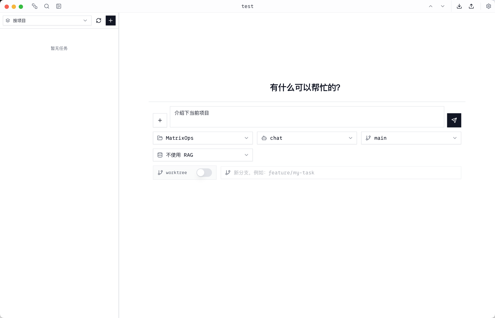

### 多 Agent 对话工作区

在对话式工作区中执行任务，`explore` 等 Worker 可被自动委派，工具调用与流式回复实时可见。

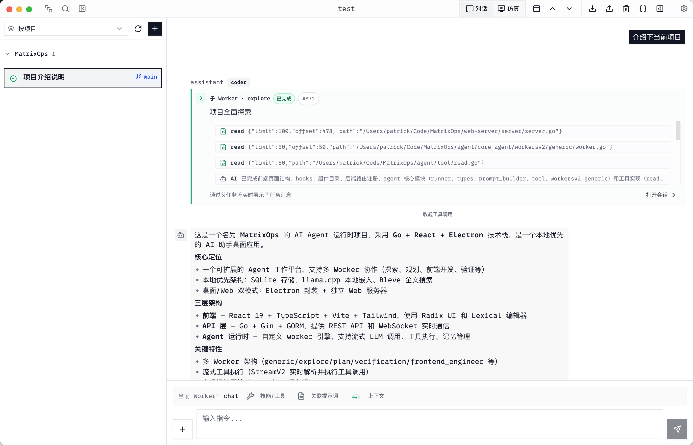

### Agent 仿真办公室

切换到仿真视图，以虚拟办公室形式展示子任务与 Worker 状态，便于一眼掌握并行进度。

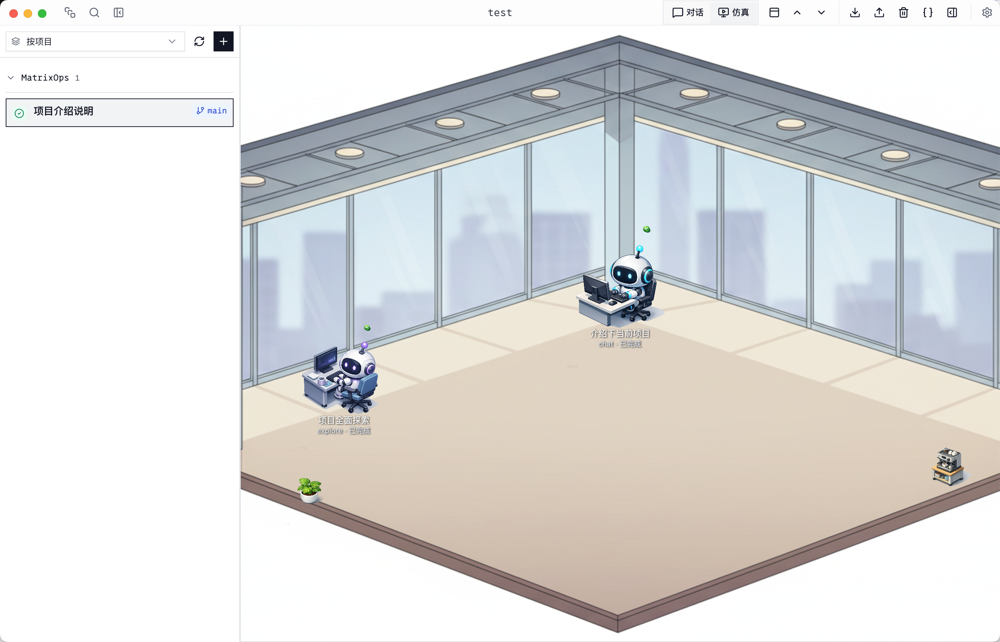

### 快照与 Diff 审查

按时间线查看每次变更，支持统一/分栏 Diff，可在提交前撤销修改或恢复快照。

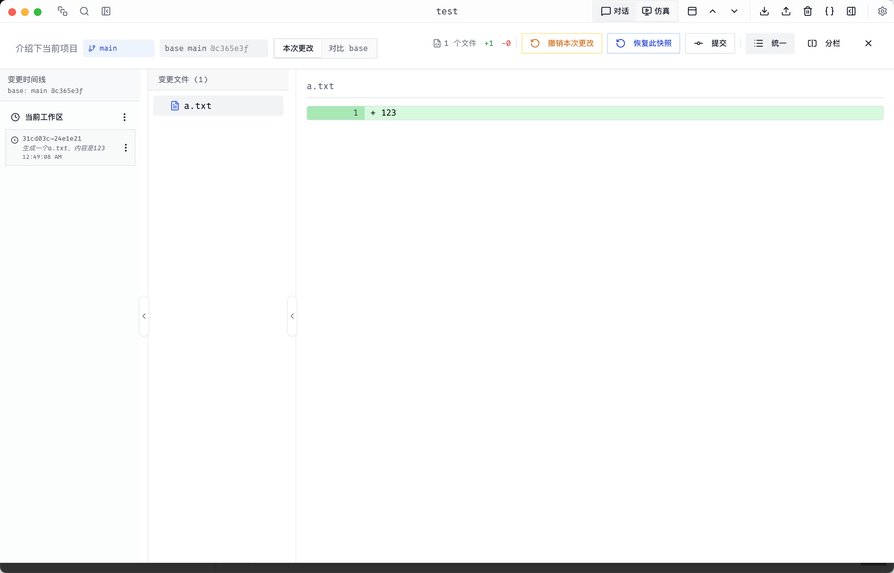

### 会话记忆管理

按会话查看、压缩或删除记忆条目，表格中展示大小、级别、工具调用等明细。

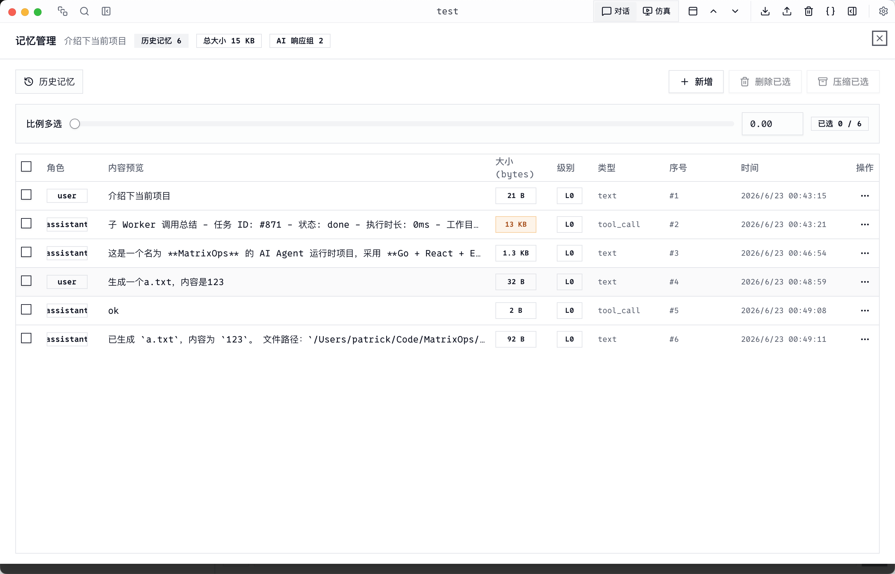

### 用量统计

监控 LLM 调用次数、首字延时、缓存命中、Token 速度与工具调用，并提供趋势图与排行榜。

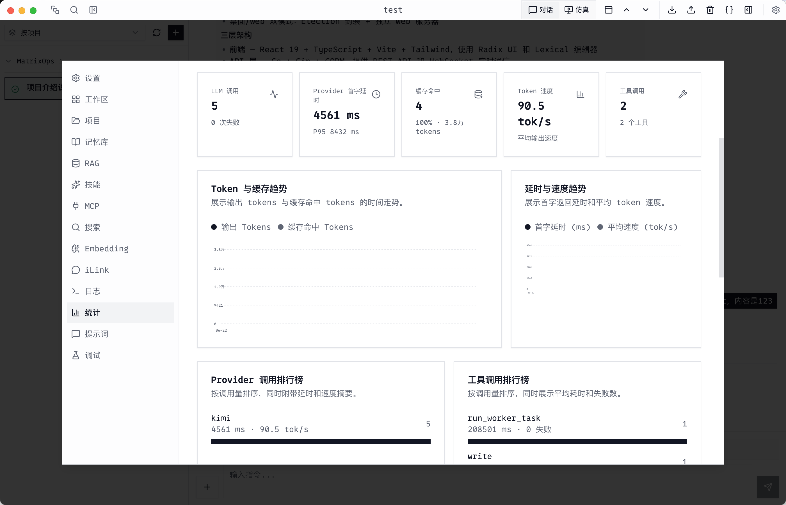

### iLink 微信机器人

绑定微信 Bot、扫码登录，将收到的消息自动路由到工作区会话，实现免打开应用的助手接入。

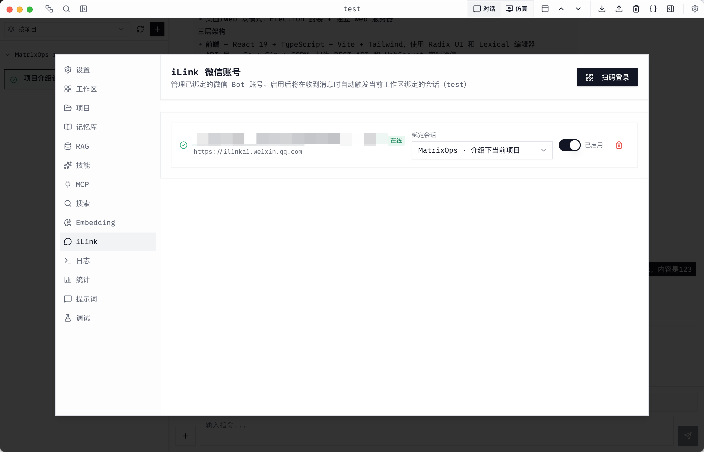

### Worker 配置

为 explore、plan、leader、verification、frontend engineer 等角色分别配置模型与提示词。

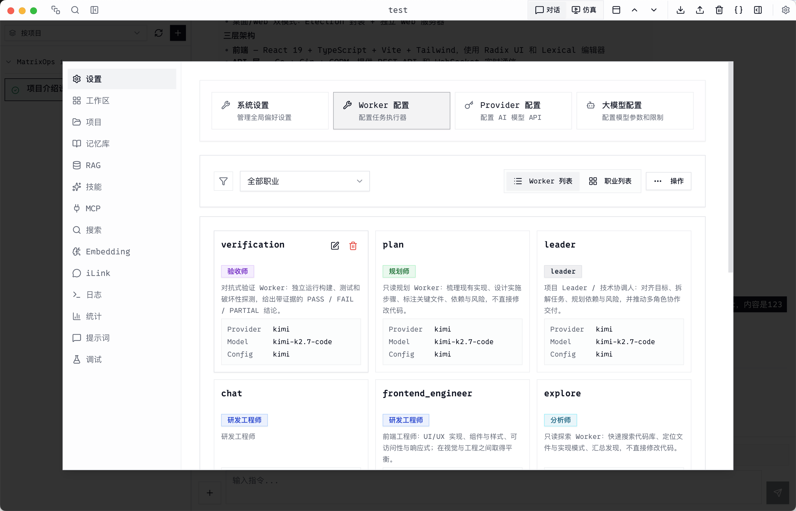

### Skills 技能市场

从多个源浏览、安装与管理 Skills，涵盖文档处理、调研工作流、前端设计等扩展能力。

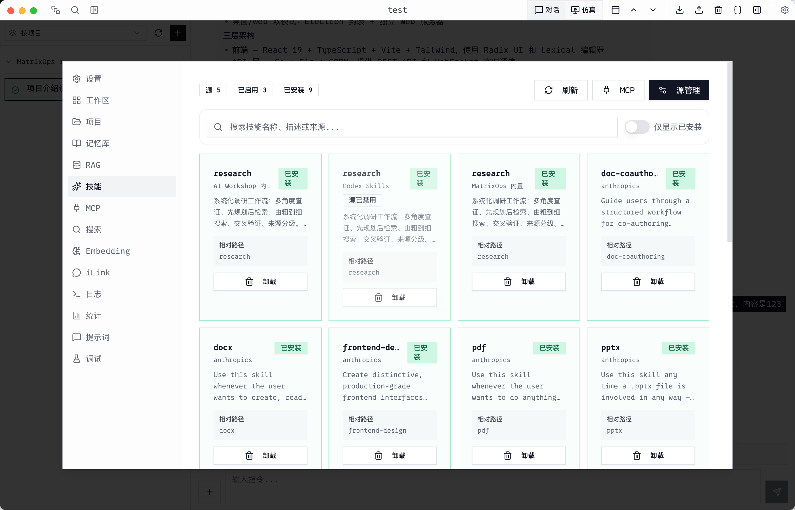

### 提示词管理

编辑全局、职业与项目三级提示词，支持 Markdown，并分层注入各 Worker 的上下文。

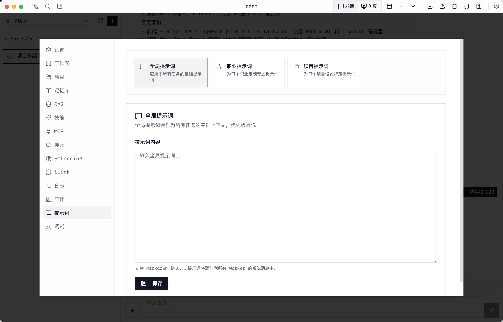

## 架构概览

```
┌─────────────────────────────────────────────────────────────┐
│  桌面 / Web UI（React + Electron）                           │
└───────────────────────────┬─────────────────────────────────┘
                            │ HTTP / WebSocket
┌───────────────────────────▼─────────────────────────────────┐
│  API 服务（Go）— 工作区、任务、会话、工具                      │
└───────────────────────────┬─────────────────────────────────┘
                            │
┌───────────────────────────▼─────────────────────────────────┐
│  Agent 运行时 — Worker、记忆、流式输出、工具执行               │
└─────────────────────────────────────────────────────────────┘
```

## 快速开始

### 桌面应用（推荐）

```bash
# 编译 CLI
go build -o build/matrixops ./cmd

# 启动桌面应用（按需构建前端并启动 Electron）
./build/matrixops app
```

或使用 [Task](https://taskfile.dev)：

```bash
task app
```

### Web 开发模式

终端 1 — 后端：

```bash
task backend
```

终端 2 — 前端：

```bash
task start
```

浏览器访问 http://localhost:3010

### 仅启动服务端

```bash
./build/matrixops server --host localhost --port 8080
```

先构建前端（`cd frontend && npm run build`）后，服务端也会托管 UI 静态资源。

## 环境要求

- **Go** 1.24+
- **Node.js** 18+
- **npm** 9+

## 安装

```bash
git clone https://github.com/z3r2ne/MatrixOps-Agent.git
cd MatrixOps-Agent

# 安装依赖
go mod download
cd frontend && npm install --legacy-peer-deps
cd ../web-server && go mod download

# 编译 CLI
cd ..
go build -o build/matrixops ./cmd
```

## CLI 命令

```bash
./build/matrixops --help
./build/matrixops app                      # 桌面应用
./build/matrixops server                   # API 服务（默认 :8080）
./build/matrixops chat "帮我总结这个仓库"
./build/matrixops version
```

更多服务端参数、对话选项与 pprof 说明见 [cmd/README.md](./cmd/README.md)。

## 常用 Task

```bash
task --list

task app                  # 桌面应用
task start                # 前端开发服务
task backend              # 后端开发服务
task electron:dev         # Electron 壳（开发模式需单独启动前后端）
task electron:build:mac   # 打包 macOS 应用
task clean                # 清理构建产物
```

## 项目结构

```
MatrixOps-Agent/
├── agent/           # Agent 运行时、Worker、工具、会话/记忆逻辑
├── cmd/             # CLI 入口（app、server、chat）
├── frontend/        # React UI + Electron 壳
├── web-server/      # HTTP API、处理器、嵌入式前端构建
├── pkgs/            # 共享 Go 包（db、search、mcp、skills 等）
├── tests/           # 集成与回归测试
└── Taskfile.yml
```

## 配置

### 数据目录

应用数据（SQLite 数据库、工作区、worktree、skills 等）默认位于：

```
~/.matrixops/
```

可通过环境变量覆盖：

```bash
export MATRIXOPS_HOME=/path/to/data
```

### 环境变量

```bash
PORT=8080
HOST=localhost
CORS_ALLOW_ALL=true
CORS_ALLOW_ORIGINS=http://localhost:3010

# 前端（开发模式）
VITE_USE_MESSAGE_V2=true
```

Electron 生产包请保持 API 为相对路径 `/api`，**不要**在构建时写死 `VITE_API_URL=http://localhost:8080/api`。

## 构建发布包

```bash
# macOS 桌面版
task electron:build:mac

# Windows / Linux
task electron:build:win
task electron:build:linux
```

产物输出在 `frontend/dist-electron/`。

## 故障排除

**端口被占用**

```bash
lsof -i :8080
./build/matrixops server --port 8081
```

**打包后的 Electron 连不上后端**

- 使用 `task electron:build:mac` 重新打包，确保 `build/matrixops` 与 `web-server/web/dist` 已打入安装包。
- 生产构建不要设置固定的 `VITE_API_URL`。

**重置前端依赖**

```bash
cd frontend
rm -rf node_modules
npm install --legacy-peer-deps
```

## 技术栈

| 层级 | 技术 |
|------|------|
| UI | React 19、TypeScript、Vite、Tailwind CSS、Electron |
| API | Go、Gin、GORM、SQLite、WebSocket |
| Agent | 自研 Worker 运行时、工具注册表、MCP、记忆检索 |

## 参与贡献

1. Fork 本仓库
2. 创建功能分支（`git checkout -b feature/my-change`）
3. 提交更改
4. 发起 Pull Request

## 许可证

本项目采用 [GNU Affero General Public License v3.0](./LICENSE)（AGPL-3.0）。

若你将修改后的版本作为网络服务运行，须向通过网络与之交互的用户提供相应源代码。
